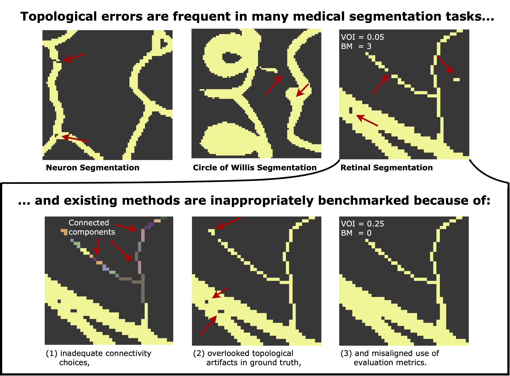

**Pitfalls of Topology-aware Image Segmentation**
========

**What is it about?** Evaluation of topology-aware image segmentation often exhibit flawed practices that skew results. In this work, we identify critical pitfalls in model evaluation that include inadequate connectivity choices, overlooked topological artifacts in ground truth annotations, and inappropriate use of evaluation metrics. This repository contains an implementation for many topology-aware segmentation methods and metrics. This code was used for conducting our empirical analysis.

  

Topological errors are present across distinct medical image segmentation tasks,
e.g., in neuron, Circle of Willis, and retinal segmentation (top). We identify three critical
pitfalls (bottom) in the evaluation of topology-aware segmentation methods. These
include inadequate connectivity choices that misrepresent a dataset’s semantics (left,
e.g., representing a single vessel as multiple components), overlooked topological artifacts
that skew evaluation results (center), and misaligned use of evaluation metrics that lack
expressive power (right, e.g., VOI entangles volumetric and topological information).

The train.py and evaluation.py files can be used to reproduce our experiments.

Please follow the procedure below. Command line arguments are provided with --help.

## Usage

### Installation of required packages in virtual environment

1.) Download venv package virtual environment (venv): python3 -m pip install --user virtualenv

2.) Create a virtual environment: python3 -m venv venv

3.) Activate virtual environment: source venv/bin/activate

4.) Install requests package: python -m pip install requests

5.) Use requests to install required packages: pip install -r requirements.txt

### Training
1.) To train from scratch:

python3 train.py --config configs/cremi_config.yaml

### Evaluation
1.) To evaluate a trained model saved in location ./models/cremi/best_model_dict.pth:

python3 evaluate.py --model ./models/cremibest_model_dict.pth --config configs/cremi/config.yaml 

# Acknowledgement
We acknowledge the following repositories from where we have inherited code snippets or copied implementation details:

1. Topograph [[code](https://github.com/AlexanderHBerger/Topograph/tree/main)][[paper](https://arxiv.org/abs/2411.03228)]
2. Multiclass BettiMatching [[code](https://github.com/AlexanderHBerger/multiclass-BettiMatching)][[paper](https://arxiv.org/abs/2403.11001)]
3. BettiMatching [[code](https://github.com/nstucki/Betti-Matching-3D)][[paper](https://arxiv.org/abs/2211.15272)]
4. HuTopo: [[code](https://github.com/HuXiaoling/TopoLoss)][[paper](https://arxiv.org/abs/1906.05404)] 

